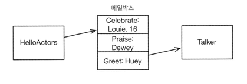
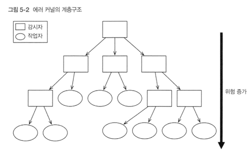

# 액터
액터 모델은 매우 광범위한 적용범위를 가진 범용 목적의 동시 프로그래밍 모델.
액터 프로그래밍은 가변 상태를 사용하긴 하지만 공유되는 부분은 제거. 상태를 캡슐화하고 메시지를 전달하는 방식으로 다른 액터와 의사소통. 객체지향 스타일의 메시지 전달 방식과 달리, 액터는 진짜 메시지를 주고 받는 방식으로 의사소통. 책에서는 엘릭서(Elixir)를 통해 액터 모델을 설명 함.

얼랭과 엘릭서에서는 액터가 '프로세스'로 불림. 

## 1일차: 메시지와 메일박스
액터 프로그래밍의 특징 중 가장 중요한 것은 메시지들이 비동기적인 방식으로 전달 된다는 점.



- 메시지는 액터에 직접 전달되지 않고 메일박스에 전달.
- 이는 액터들은 서로 분리되어 있음을 의미. (상태를 공유하지 않음)
- 액터는 자신의 속도에 맞춰 동작하고 메시지를 전송하기 위해 블로킹 되지 않음.
- 액터는 다른 액터들과 동시에 동작하지만 자신에게 전달되는 메시지는 순차적 처리.


##  2일차: 에러 처리와 유연성 
```elixir
defmodule LinkTest do
 def loop do
   receive do
    {:exit_because, reason} -> exit(reason)
    {:link_to, pid} -> Process.link(pid)
    {:EXIT, pid, reason} -> IO.puts("#{inspect(pid)} exited because #{reason}")
   end
   loop
 end
end
```

`Porcess.link()`를 이용해 두 프로세스 사이를 원하는 시점 어느 때나 연결 가능.

```elixir
iex(1)> pid1 = spawn(&LinkTest.loop/0)
iex(2)> pid2 = spawn(&LinkTest.loop/0)
iex(3)> send(pid1, {:link_to, pid2)
iex(4)> send(pid2, {:exit_because, :bad_thing_happend})
```

위 예에서 pid1을 pid2와 링크했지만 연결은 쌍방향으로 이루어진다. 또한 연결은 에러를 전파하여 두 개 프로세스가 서로 연결되었는데 하나라도 비정상적으로 종료하면 다른 하나도 역시 종료된다.

### error kernel pattern

> 소프트웨어를 설계하는 데는 두 방법이 있다. 하나는 단순하게 만들어서 아무 결함이 없도록 만드는 것이고, 다른 하나는 복잡하게 만들어서 눈에 드러나는 결함이 없도록 만드는 것이다. - 토니 호어

액터 프로그래밍은 에러-커널 패턴을 통해 장애 허용 수준이 높은 코드를 작성하는 것을 지원. 어떤 소프트웨어 시스템에서 에러 커널이란 시스템 전체가 정상적으로 동작하기 위해 반드시 에러가 없거나, 혹은 있으면 즉각적으로 수정되어야 하는 것이 핵심.
액터 프로그램에서 에러 커널은 가장 상위에 위치하는 감시자다. 감시자는 필요에 따라 자식 액터들을 시작하고, 중단하고, 재시작하는 일을 수행한다.



위 그림과 같이 각 모듈은 자신만의 고유한 에러 커널을 차례로 가진다. 이런 패턴을 사용하면 위험이 수반되는 동작이 트리의 가장 하위 부분의 액터에 전담되는 결과를 낳는다.

### 크래시하게 내버려 두어라
액터 프로그래밍에서는 방어적 프로그래밍 대신 크래시하게 내버려 두고, 액터의 감시자가 문제를 해결하도록 맡긴다. 이런 철학은 몇 가지 장점을 갖는다.

- 정상적인 경로와 에러를 처리하는 코드가 분리되어 있기에 코드가 간단하고 이해하기 쉽다
- 액터들은 서로 분리되어 있고 상태를 공유하지 않기 때문에, 어느 한 액터의 실패가 다른 액터에 악영향을 미칠 위험이 거의 없다. 특히 감시되고 있는 액터가 크래시했다고 그것을 감시하는 액터가 덩달아 크래시할 가능성은 없다
- 감시자는 에러를 처리할 뿐만 아니라 에러가 발생했다는 사실을 감추지 않고 로그로 기록한다.
